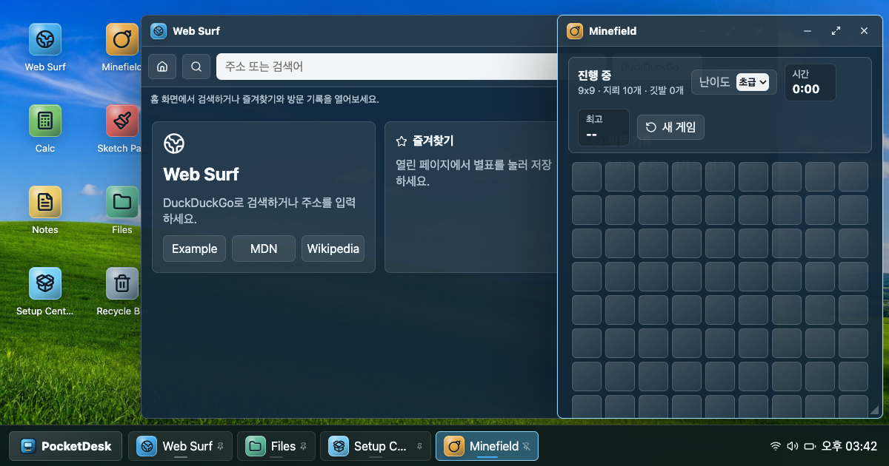

# PocketDesk OS

[](https://github.com/Seung-Won-Yu/pocket-desk-os/actions/workflows/ci.yml)
[](https://github.com/Seung-Won-Yu/pocket-desk-os/actions/workflows/pages.yml)

브라우저 안에서 Windows 11 사용 흐름을 실행하는 React/Vite 기반 웹 데스크톱입니다. 창 관리자, 시작 메뉴, 작업 표시줄, 내 PC, 파일 탐색기, 휴지통, 메모장, 그림판, 계산기, 지뢰찾기와 웹 브라우저가 실제 상태를 저장하며 동작합니다.



## 바로가기

| 항목 | 링크 |
| --- | --- |
| 배포 주소 | [https://seung-won-yu.github.io/pocket-desk-os/](https://seung-won-yu.github.io/pocket-desk-os/) |
| GitHub 저장소 | [https://github.com/Seung-Won-Yu/pocket-desk-os](https://github.com/Seung-Won-Yu/pocket-desk-os) |
| CI | [GitHub Actions CI](https://github.com/Seung-Won-Yu/pocket-desk-os/actions/workflows/ci.yml) |
| Pages 배포 | [Deploy GitHub Pages](https://github.com/Seung-Won-Yu/pocket-desk-os/actions/workflows/pages.yml) |

## 프로젝트 요약

PocketDesk OS는 Windows 11의 셸 구조와 사용 순서를 웹 기술로 구현한 정적 앱입니다. 동작하지 않는 설치 버튼이나 가짜 시스템 수치는 노출하지 않으며, 표시되는 기능은 브라우저 안에서 완료 가능한 흐름만 제공합니다.

## 실행

```bash
npm install
npm run dev
```

로컬 주소:

```text
http://127.0.0.1:5173/
```

## 품질 확인

```bash
npm run release:check
npm run qa:pages
npm run qa:smoke
```

| 명령어 | 설명 |
| --- | --- |
| `npm run release:check` | 배포 필수 파일, PWA 자산, GitHub Actions, 문서 구성을 검사합니다. |
| `npm run qa:pages` | GitHub Pages 하위 경로(`/pocket-desk-os/`) 기준으로 빌드하고 공개 파일을 확인합니다. |
| `npm run qa:smoke` | Playwright로 실제 브라우저를 열어 시작 메뉴, 앱 실행, 파일, 휴지통, 창 스냅 등 핵심 흐름을 검사합니다. |

## 배포

현재 배포는 GitHub Actions와 GitHub Pages로 자동화되어 있습니다.

1. `main` 브랜치에 push합니다.
2. `.github/workflows/ci.yml`이 릴리즈/Pages 빌드 검사를 실행합니다.
3. `.github/workflows/pages.yml`이 `dist/`를 GitHub Pages에 배포합니다.
4. 배포 결과는 [PocketDesk OS Live](https://seung-won-yu.github.io/pocket-desk-os/)에서 확인합니다.

정적 호스팅 설정은 [DEPLOYMENT.md](./DEPLOYMENT.md)에 정리되어 있습니다.

## 앱 구성

| 앱 | 역할 |
| --- | --- |
| 내 PC | 드라이브, 기본 폴더, 시스템 상태 허브 |
| 웹 브라우저 | 검색, 즐겨찾기, 방문 기록, 실제 새 탭 열기 |
| 지뢰찾기 | 난이도, 타이머, 기록 저장 |
| 계산기 | 일반/공학 모드와 키보드 입력 |
| 그림판 | 브러시, 도형, 팔레트, PNG 저장 |
| 메모장 | 여러 노트, 자동 저장, Markdown 미리보기 |
| 파일 탐색기 | IndexedDB 기반 파일, 정렬, 보기 전환, 다중 선택 |
| 휴지통 | 삭제 항목 복원, 영구 삭제 확인, 비우기 |
| 설정 | 개인 설정, 창 배치, 시스템 소리 |

## 주요 기능 (Current Features)

- 내 PC와 휴지통 중심 바탕 화면, 시작 메뉴, 중앙 작업 표시줄, 시스템 트레이
- 드래그/리사이즈 가능한 창, 스냅 레이아웃, 오류 복구 화면
- 부팅 화면, 잠금 화면, 재시작/종료/전원 켜기 시뮬레이션
- 창 위치, 크기, z-index, 최소화/최대화 상태 저장
- 바탕화면 아이콘 위치 저장, 크기 변경, 이름/유형/수정일 정렬, 그리드 맞춤
- 시작 메뉴 고정됨, 모든 앱, 추천, 검색, 앱 별칭
- 실행 창: `computer`, `explorer`, `calc`, `notepad`, `mspaint`, URL/검색어 전달
- 창 스냅, titlebar 시스템 메뉴, Alt+Tab, Esc, Ctrl+S 단축키
- 작업 표시줄 context menu 핀/언핀, hover/focus 미리보기
- 실제 온라인 상태, 시스템 소리 토글, 알림 센터
- IndexedDB 기반 가상 파일 시스템
- 파일 탐색기 자세히/목록/큰 아이콘 보기, 오름차순/내림차순 정렬
- 파일 탐색기 `Ctrl+A`, `F2`, `Enter`, `Delete`, 방향키 다중 선택/조작
- 파일 연결: `.txt`/`.md` 메모장, `.png`/`.canvas` 그림판, `.url` 웹 브라우저, `.game` 지뢰찾기
- 휴지통 복원/영구 삭제 확인/비우기 흐름
- ZIP 백업 export/import
- Windows 감성의 자체 제작 배경화면 8종
- PWA manifest, service worker, install icon, social preview, `robots.txt`, `llms.txt`
- GitHub Pages, Vercel, Netlify 배포 설정
- GitHub Actions CI, Pages deploy workflow, release check, Playwright smoke QA

## 기술 스택

| 영역 | 사용 기술 |
| --- | --- |
| Frontend | React 18, TypeScript, Vite |
| UI/Icon | CSS, lucide-react |
| Storage | localStorage, IndexedDB |
| QA | Playwright, custom release check scripts |
| 배포 | GitHub Actions, GitHub Pages, Vercel, Netlify |

## 에셋 관리

```bash
npm run icons
npm run social:preview
```

- `npm run icons`: PocketDesk PWA 아이콘을 다시 생성합니다.
- `npm run social:preview`: 실제 앱 화면 기반 1200x630 공유 이미지를 생성합니다.

## 개발 로드맵 (Development Roadmap)

### 1. OS Feel

- [x] 배경화면 갤러리
- [x] 창 위치/크기/열린 앱 상태 저장
- [x] 데스크톱 아이콘 드래그 위치 저장
- [x] 바탕화면 우클릭 메뉴
- [x] 바탕화면 아이콘 보기, 정렬, 그리드 맞춤
- [x] 시작 메뉴 검색
- [x] 알림 토스트와 알림 센터
- [x] 부팅/잠금 화면
- [x] 전원 메뉴
- [x] 키보드 단축키
- [x] Run dialog
- [x] 창 스냅과 미리보기
- [x] 창 시스템 메뉴
- [x] 작업표시줄 핀/언핀
- [x] 작업표시줄 미리보기
- [x] 시스템 트레이 빠른 설정
- [x] 시작 메뉴 고정됨, 모든 앱, 추천

### 2. Virtual File System

- [x] IndexedDB 파일/폴더 저장
- [x] 여러 노트 파일
- [x] 그림판 캔버스 저장
- [x] 파일 열기, 이름 변경, 삭제
- [x] 파일 정렬, 보기 전환, 키보드 다중 선택
- [x] 파일 확장자 연결
- [x] 휴지통 복원/비우기
- [x] ZIP export/import

### 3. App Upgrades

- [x] 브라우저 북마크, 히스토리, 홈 화면, 검색 엔진 선택
- [x] 그림판 undo/redo, 도형, 팔레트, PNG export
- [x] 지뢰찾기 난이도, 타이머, 최고 기록
- [x] 계산기 키보드 입력과 공학 모드
- [x] 메모장 탭, 자동 저장, Markdown preview
- [x] 내 PC 드라이브/기본 폴더 허브
- [x] 실제 동작하지 않는 설치형 앱 흐름 제거

### 4. Product Polish

- [x] PocketDesk OS 네이밍/로고
- [x] 통일된 앱 아이콘 스타일
- [x] 시스템 사운드
- [x] PWA 설치 지원
- [x] GitHub Pages 배포
- [x] 공개 공유 메타데이터와 social preview 이미지
- [x] release readiness check
- [x] GitHub Pages base-path build check
- [x] Playwright smoke QA
- [x] GitHub Actions CI
- [x] README, DEPLOYMENT, CONTRIBUTING, CHANGELOG 문서화

## 저장 키 (Persistence Keys)

- `pocket-desk-theme`
- `pocket-desk-wallpaper-v2`
- `pocket-desk-windows-v1`
- `pocket-desk-icons-v2`
- `pocket-desk-icon-view-v1`
- `pocket-desk-icon-sort-v1`
- `pocket-desk-icon-grid-v1`
- `pocket-desk-explorer-sort-v1`
- `pocket-desk-explorer-sort-direction-v1`
- `pocket-desk-explorer-view-v1`
- `pocket-desk-desktop-items-v1` (legacy migration source)
- `pocket-desk-note`
- `pocket-desk-mines-best-records-v1`
- `pocket-desk-taskbar-pinned-v2`

## IndexedDB Stores

- `pocket-desk-vfs` / `entries`: 가상 파일, 폴더, 바로가기, 앱 파일 레코드

## 참고

PocketDesk OS는 Microsoft Windows 파일, 로고, 배경화면을 포함하지 않습니다. 데스크톱 메타포와 분위기만 참고하고, 배경화면과 브랜드 자산은 프로젝트용으로 별도 제작했습니다.
