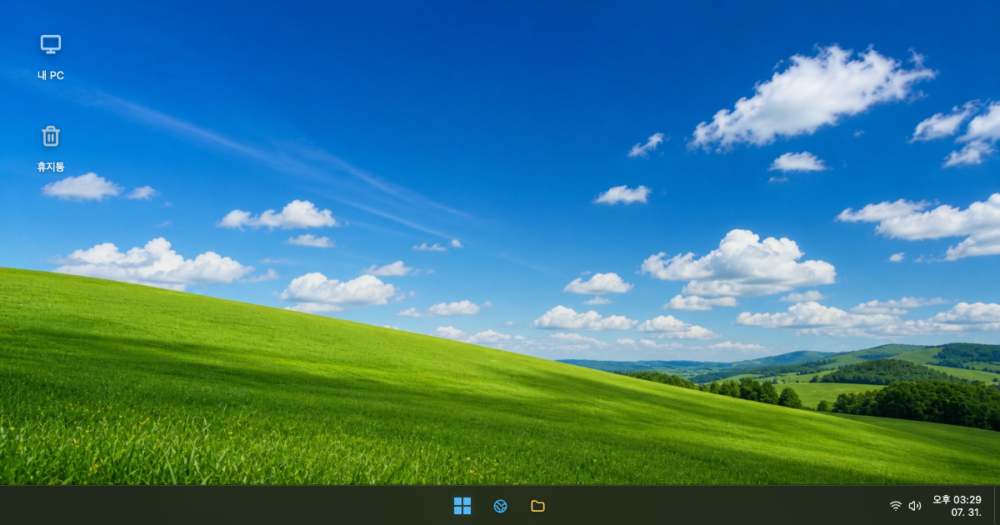

<h1 align="center">PocketDesk OS</h1>

<p align="center">
  <strong>브라우저 안에서 직접 조작하는 Windows 11 스타일 데스크톱</strong>
</p>

<p align="center">
  부팅부터 바탕 화면, 창 관리, 파일 탐색기와 기본 앱까지 하나의 웹 애플리케이션으로 구현했습니다.
</p>

<p align="center">
  <a href="https://seung-won-yu.github.io/pocket-desk-os/"><strong>웹에서 바로 실행</strong></a>
  ·
  <a href="./DEPLOYMENT.md">배포 안내</a>
</p>

<p align="center">
  <a href="https://github.com/Seung-Won-Yu/pocket-desk-os/actions/workflows/ci.yml">
    
  </a>
  <a href="https://github.com/Seung-Won-Yu/pocket-desk-os/actions/workflows/pages.yml">
    
  </a>
</p>



## PocketDesk OS

PocketDesk OS는 Windows 11의 데스크톱 사용 흐름을 웹에서 재현한 React 기반 시뮬레이터입니다. 단순한 화면 모형이 아니라 창 이동과 크기 조절, 파일 생성과 삭제, 앱 실행, 상태 저장까지 실제로 동작합니다.

새로고침해도 창 위치, 바탕 화면 아이콘, 테마와 가상 파일이 유지되며 데스크톱과 모바일 브라우저에서 설치 가능한 PWA로 사용할 수 있습니다.

## 구현된 Windows 경험 (Current Features)

| 영역          | 동작                                                                                              |
| ------------- | ------------------------------------------------------------------------------------------------- |
| 시작 흐름     | 부팅, 잠금 화면, 로그인, 잠금, 재시작, 종료                                                       |
| 데스크톱      | 아이콘 선택·이동·정렬, 그리드 맞춤, 이름 변경, 우클릭 메뉴                                        |
| 시작 메뉴     | 앱 목록, 앱·파일 검색(실제 폴더 경로 표시), 앱 고정·해제, 전원 메뉴                               |
| 작업 표시줄   | 실행 앱 표시, 다중 창 개수·미리보기, 우클릭 점프 리스트(최근 항목), 최소화·복원, 바탕 화면 보기   |
| 창 관리자     | 이동, 8방향 크기 조절, 최소화, 최대화, 절반·사분면 스냅, 화면 나누기 후보, 앱별 다중 창           |
| 가상 데스크톱 | 작업 보기, 데스크톱 최대 6개, 창 이동, 데스크톱 전환·닫기                                         |
| 시스템 UI     | 시스템 트레이, 달력, 알림 센터, 실행 창, 작업 표시줄 검색·우클릭 메뉴, 전환 효과                  |
| 클립보드      | 모든 창이 공유하는 하나의 클립보드, 복사·잘라내기·붙여넣기                                        |
| 설정          | 테마, 배경, 소리, 기본 앱, 사용자 이름, 24시간제 시계                                             |
| 파일 시스템   | IndexedDB 기반 폴더 계층(문서·사진·게임·다운로드), 이동·복사, 연결 앱, 트리 단위 휴지통, ZIP 백업 |
| 상태 저장     | 창, 아이콘, 테마, 설정과 파일을 브라우저에 자동 보존                                              |

## 기본 앱

| 앱                | 지원 기능                                                                                                                     |
| ----------------- | ----------------------------------------------------------------------------------------------------------------------------- |
| 내 PC             | 기본 폴더, 로컬 디스크와 저장 상태 확인                                                                                       |
| 파일 탐색기       | 독립된 여러 창, 실제 폴더 경로, 뒤로·앞으로·위로, 새 폴더·문서, 드래그 이동, 복사·검색·정렬·속성                              |
| 휴지통            | 파일과 폴더 트리 복원, 영구 삭제, 휴지통 비우기                                                                               |
| Microsoft Edge    | 주소 이동, 검색, 방문 기록, 창 안 웹 보기, 읽기 보기, 페이지 다운로드(읽기 보기는 Markdown, 웹 보기는 .url), 차단 페이지 복구 |
| 메모장            | 여러 문서, 자동 저장, Windows형 열기·다른 이름으로 저장, Markdown 미리보기                                                    |
| 그림판            | 브러시, 지우개, 도형, 색상 선택, Windows형 PNG 열기·저장                                                                      |
| 사진              | 이미지 보기, 이전·다음, 확대·축소, 회전, 이름 바꾸기                                                                          |
| 명령 프롬프트     | 가상 파일 시스템 위에서 동작하는 셸, 명령 기록, Tab 자동 완성                                                                 |
| 작업 관리자       | 실행 중인 창 목록, 작업 끝내기, CPU·메모리 그래프                                                                             |
| 이벤트 뷰어       | 파일·창 활동을 채널별로 기록, 수준·텍스트 필터, 세부 정보                                                                     |
| 레지스트리 편집기 | 실제 저장된 설정 값 보기·편집·삭제                                                                                            |
| 계산기            | 일반·공학 계산과 키보드 입력                                                                                                  |
| 알람 및 시계      | 알람(요일 반복)과 타이머는 셸에서 발화 — 창을 닫거나 새로 고쳐도 동작, 실제 시간대 기반 세계 시계, 스톱워치·플래그 기록       |
| 지뢰찾기          | 난이도 선택, 첫 클릭 보호, 타이머, 깃발, 승패와 최고 기록                                                                     |
| 설정              | 테마, 자체 제작 배경 화면 8종, 시스템 소리, 창 배치 초기화                                                                    |

## Edge와 사과게임

Microsoft Edge 앱은 주소를 새 탭으로 넘기지 않고 PocketDesk OS 창 안에서 먼저 엽니다.

- 주소 입력과 웹 검색
- 뒤로, 앞으로, 새로 고침, 홈
- 즐겨찾기와 방문 기록
- iframe을 허용하는 실제 웹사이트 표시
- iframe 차단 가능성이 높은 사이트의 자동 읽기 보기
- 표시 실패 시 읽기 보기 또는 새 탭으로 이어지는 복구 화면
- 시작 화면의 **사과게임** 바로가기

사과게임은 [Apple Burst](https://seung-won-yu.github.io/apple-burst/) 데스크톱 버전을 Edge 창 안에서 바로 실행합니다.

## 명령 프롬프트

명령 프롬프트는 화면 흉내가 아니라 IndexedDB 가상 파일 시스템을 직접 읽고 씁니다. 여기서 만든 파일은 파일 탐색기, 휴지통, ZIP 백업에서 같은 항목으로 보입니다.

```text
C:\Users\PocketDesk\Desktop> md 프로젝트
C:\Users\PocketDesk\Desktop> cd 프로젝트
C:\Users\PocketDesk\Desktop\프로젝트> echo 첫 줄 > 메모.txt
C:\Users\PocketDesk\Desktop\프로젝트> echo 둘째 줄 >> 메모.txt
C:\Users\PocketDesk\Desktop\프로젝트> type 메모.txt
```

| 분류   | 명령                                                                                                  |
| ------ | ----------------------------------------------------------------------------------------------------- |
| 탐색   | `dir`(`ls`), `cd`(`chdir`), `pwd`, `tree`, `find`(`findstr`)                                          |
| 파일   | `type`(`cat`), `echo` + `>`·`>>`, `md`(`mkdir`), `del`(`erase`), `rd`(`rmdir`), `copy`, `move`, `ren` |
| 실행   | `start`, `call`, `tasklist`, `taskkill /pid <번호>`, `exit`                                           |
| 시스템 | `set`, `systeminfo`, `ver`, `vol`, `whoami`, `hostname`, `date`, `time`, `cls`                        |

`↑`·`↓`로 명령 기록을 넘기고 `Tab`으로 현재 폴더의 이름을 자동 완성합니다. `help`가 전체 목록을 표시합니다.

### 환경 변수, 와일드카드, 파이프, 배치 파일

```text
C:\Users\PocketDesk\Desktop> set PROJECT=문서
C:\Users\PocketDesk\Desktop> cd %PROJECT%
C:\Users\PocketDesk\Desktop\문서> dir *.txt
C:\Users\PocketDesk\Desktop\문서> dir | find 메모
C:\Users\PocketDesk\Desktop\문서> del *.txt
```

- **환경 변수** — `set NAME=값`으로 지정하고 `%NAME%`으로 사용합니다. `set NAME=`은 삭제, `set`만 입력하면 전체 목록입니다. `%CD%`, `%USERNAME%`, `%COMPUTERNAME%`, `%DATE%`, `%TIME%`, `%USERPROFILE%`은 기본 제공됩니다
- **와일드카드** — `*`와 `?`를 `dir`, `del`, `copy`, `move`에서 사용합니다. 파일 대상 명령은 폴더를 쓸어담지 않습니다
- **파이프** — `|` 뒤에 `find`, `findstr`, `sort`, `more`를 연결합니다. 부수 효과는 첫 단계만 수행합니다
- **배치 파일** — `.bat` 파일 이름을 입력하거나 `call 파일.bat`으로 실행합니다. `rem`과 `::` 주석, 빈 줄은 건너뜁니다. 각 줄은 앞 줄이 파일 시스템에 남긴 결과를 보고 실행됩니다
- **`^` 이스케이프** — `echo md 백업 ^> 로그.txt > 설치.bat`처럼 `>`나 `|`를 리터럴로 넣을 때 사용합니다

명령 해석은 `src/shell/commandShell.ts`의 순수 함수가 담당합니다. 문자열과 현재 상태를 받아 출력 줄과 적용할 효과 목록만 반환하므로 UI 없이 단위 테스트할 수 있습니다.

## 주요 조작

| 입력                   | 동작                                                   |
| ---------------------- | ------------------------------------------------------ |
| 더블클릭               | 바탕 화면 아이콘 또는 파일 실행                        |
| 우클릭                 | 바탕 화면·아이콘·파일 메뉴 열기                        |
| `Alt + Tab`            | 열린 창 전환                                           |
| `Alt + F4`             | 현재 창 닫기                                           |
| `Win/⌘ + E`            | 파일 탐색기 열기                                       |
| `Win/⌘ + R`            | 실행 창 열기                                           |
| `Win/⌘ + D`            | 바탕 화면 표시·복원                                    |
| `Ctrl + Alt + ←/→/↑`   | 현재 창 스냅                                           |
| `Win/⌘ + ←/→/↑/↓`      | 현재 창 스냅 단계 이동 (절반 → 사분면 → 최대화 → 복원) |
| `Win/⌘ + Tab`          | 작업 보기 열기·닫기                                    |
| `Win/⌘ + Ctrl + ←/→`   | 가상 데스크톱 전환                                     |
| `Win/⌘ + I`            | 설정 열기                                              |
| `Ctrl + Shift + Esc`   | 작업 관리자 열기                                       |
| `Win/⌘ + M`            | 모든 창 최소화                                         |
| `Win/⌘ + L`            | 잠금                                                   |
| `Ctrl + C` / `X` / `V` | 복사 · 잘라내기 · 붙여넣기 (바탕 화면과 탐색기 공통)   |
| `Ctrl + A`             | 전체 선택                                              |
| `F2`                   | 선택한 파일 또는 아이콘 이름 변경                      |
| `Delete`               | 선택 항목을 휴지통으로 이동                            |
| `Alt + ←/→/↑`          | 탐색기 뒤로·앞으로·상위 폴더 이동                      |
| `Ctrl + O`             | 메모장·그림판 파일 열기                                |
| `Ctrl + S`             | 메모장·그림판 현재 파일 저장                           |
| `Ctrl + Shift + S`     | 메모장·그림판 다른 이름으로 저장                       |

## 기술 스택

| 영역         | 기술                                                 |
| ------------ | ---------------------------------------------------- |
| 애플리케이션 | React 18, TypeScript, Vite                           |
| 인터페이스   | CSS, lucide-react                                    |
| 저장소       | localStorage, IndexedDB                              |
| 콘텐츠       | react-markdown                                       |
| 테스트       | Vitest 단위 테스트, Playwright, 릴리즈 검증 스크립트 |
| 코드 품질    | ESLint, Prettier                                     |
| 배포         | GitHub Actions, GitHub Pages                         |

## 로컬 실행

Node.js 20 이상을 권장합니다.

```bash
npm install
npm run dev
```

개발 서버는 기본적으로 `http://127.0.0.1:5173/`에서 실행됩니다.

프로덕션 빌드를 확인하려면 다음 명령을 실행합니다.

```bash
npm run build
npm run preview
```

## 품질 확인

커밋 전 게이트는 하나입니다.

```bash
npm run qa:all
```

여덟 단계를 순서대로 실행하며, 하나라도 실패하면 멈춥니다.

| 명령            | 확인 범위                                                               |
| --------------- | ----------------------------------------------------------------------- |
| `lint`          | ESLint 규칙과 React Hooks 의존성                                        |
| `format:check`  | Prettier 코드 스타일                                                    |
| `test`          | 파일 시스템 모델, ZIP 백업, 셸·앱 로직 단위 테스트                      |
| `audit:runtime` | 런타임 의존성 취약점 (`npm audit`, high 이상)                           |
| `release:check` | 배포 필수 파일, PWA 자산, workflow와 문서                               |
| `qa:pages`      | `/pocket-desk-os/` 하위 경로 기준 GitHub Pages 빌드                     |
| `qa:smoke`      | 시작 메뉴, 앱, 파일, 휴지통과 창 관리의 실제 브라우저 흐름 (Playwright) |
| `qa:pwa`        | 서비스 워커 설치, 핵심 번들 사전 캐시와 실제 오프라인 재실행            |

## 프로젝트 구조

```text
src/App.tsx           앱 상태 연결과 창 오케스트레이션
src/shell/            셸 타입·상수, 창 상태, 명령 셸, 데스크톱 레이아웃 계산
src/shell/components/ 작업 표시줄, 시작 메뉴, 창 프레임, 작업 보기 등 셸 UI
src/apps/             모든 기본 앱의 독립 기능 모듈
src/components/       열기·저장 등 Windows형 공통 UI
src/vfs/              IndexedDB 저장소, 파일 모델과 ZIP 백업 검증
src/pwa/              서비스 워커 등록과 안전한 업데이트 적용
src/styles.css        Windows 스타일 UI와 전환 효과
src/ErrorBoundary.tsx 앱 오류 복구 화면
public/brand/         PWA 아이콘과 공유 이미지
public/wallpapers/    프로젝트용 배경 화면
scripts/              릴리즈, Pages와 Playwright 검증
DEPLOYMENT.md         정적 호스팅과 배포 안내
```

## 데이터 저장 (Persistence Keys)

- 창, 아이콘, 테마와 앱 설정: `pocket-desk-*` localStorage
- 파일, 폴더와 바로가기: `pocket-desk-vfs` IndexedDB
- 백업과 복원: 파일 탐색기의 ZIP 내보내기·가져오기

모든 데이터는 사용 중인 브라우저에 저장되며 브라우저 사이트 데이터를 지우면 초기화됩니다.

## 개발 로드맵 (Development Roadmap)

- [x] Windows 11 스타일 데스크톱 셸과 창 관리자
- [x] IndexedDB 가상 파일 시스템과 휴지통
- [x] 실제 폴더 계층, 탐색 기록, 드래그 이동과 폴더 트리 복원
- [x] 파일 탐색기 다중 창과 메모장·그림판 공용 열기·저장 대화상자
- [x] 기본 앱, 파일 연결과 브라우저 내 웹 실행
- [x] PWA, 자동 테스트와 GitHub Pages 배포
- [x] 모든 기본 앱 모듈 분리와 장기 유지보수 구조 개선
- [x] IndexedDB 원자적 저장, 스키마 마이그레이션과 손상 백업 방어
- [x] iframe 차단 사이트 복구 UX
- [x] 오프라인 앱 셸과 사용자 선택형 PWA 업데이트
- [x] 데스크톱 셸 모듈 분리와 App.tsx 축소
- [x] ESLint·Prettier·Vitest 도입과 핵심 로직 단위 테스트
- [x] 가상 파일 시스템 위에서 동작하는 명령 프롬프트
- [x] 작업 관리자와 작업 표시줄 우클릭 셸 메뉴
- [x] 가상 데스크톱과 작업 보기
- [x] 사분면 스냅과 8방향 창 크기 조절
- [x] 셸 환경 변수, 와일드카드, 파이프와 배치 파일
- [x] IndexedDB 저장 검증 로직 단위 테스트
- [x] 창 전체가 공유하는 시스템 클립보드와 잘라내기
- [x] 사진 뷰어와 파일 형식별 기본 앱 지정
- [x] 작업 표시줄 검색과 설정 확장 (계정·시간·앱)
- [x] 이벤트 뷰어와 레지스트리 편집기
- [x] 화면 나누기 후보와 탐색기·바탕 화면 양방향 드래그
- [x] 키보드 접근성 점검과 포커스 표시·복원·트랩
- [x] 메뉴·그리드·탭의 화살표 키 모델과 단일 탭 스톱
- [x] Content Security Policy와 프레임 샌드박스 탈출 차단
- [x] 실제 로컬 폴더 가져오기·내보내기 (로컬 실행 전용)
- [x] 이미지 원본 바이트 저장으로 저장소 사용량 절감
- [x] 영속 셸 이벤트 로그와 시작 메뉴 고정 관리
- [x] 알람 및 시계 — 셸 스케줄러가 창 없이도 알람·타이머 발화
- [x] 시작 검색의 파일 실제 경로 표시
- [x] 작업 표시줄 점프 리스트와 Intl 시간대 세계 시계
- [x] 다운로드 시스템 폴더와 Edge 페이지 다운로드
- [x] 점프 리스트가 실제 열람 이력 순으로 정렬

구현 과정과 설계 기준은 [개발 기록](./docs/DEVELOPMENT-NOTES.md)에 정리했습니다.

## 배포

`main` 브랜치에 푸시하면 GitHub Actions가 빌드와 릴리즈 검사를 수행하고, Pages workflow가 결과물을 자동 배포합니다.

- 서비스: [seung-won-yu.github.io/pocket-desk-os](https://seung-won-yu.github.io/pocket-desk-os/)
- 배포 설정: [DEPLOYMENT.md](./DEPLOYMENT.md)

## 보안

공개 배포본은 다음을 지킵니다.

- **Content Security Policy** — 프로덕션 빌드에 `<meta>`로 적용. `script-src 'self'`, `object-src 'none'`, `frame-src https:`로 한정
- **동일 오리진 프레임 금지** — GitHub Pages는 계정당 오리진이 하나이므로, 같은 오리진 주소는 창 안에서 열지 않고 새 탭으로 보냅니다. 동일 오리진 프레임은 `allow-same-origin`과 함께면 샌드박스를 탈출할 수 있습니다
- **실제 파일 접근은 로컬 전용** — `localhost`에서만 활성화됩니다. 브라우저 권한 프롬프트는 사용자가 폴더를 골랐다는 것만 보장하고, 앱이 장악되는 경우를 막지 못하므로 공개본에는 기능이 없습니다
- **비밀 파일은 읽지 않음** — 가져오기가 `.env`·`id_rsa`·`*.pem`·`credentials` 등을 건너뛰고 `.git`·`.ssh`·`node_modules`는 순회하지 않습니다
- **프레임 안에서 실행 거부** — GitHub Pages는 `frame-ancestors` 헤더를 설정할 수 없으므로, 프레임 안에서는 앱이 마운트되기 전에 실행을 거부합니다
- **URL 스킴 검사** — href·이미지·내비게이션·프록시에 닿는 모든 URL이 http(s)인지 확인됩니다. `javascript:`·`data:`는 통과하지 못합니다
- **읽기 보기가 비밀을 넘기지 않음** — 프록시로 보내는 주소에서 쿼리스트링·자격정보·프래그먼트를 제거하고, 토큰이 담길 수 있는 주소는 읽기 보기를 자동 선택하지 않습니다
- **프레임 샌드박스** — `allow-forms allow-scripts`만 부여합니다. `allow-same-origin`이 없으므로 프레임이 어디로 이동해도 이 앱의 저장소에 닿을 수 없습니다

### 남은 한계

정직하게 적어 둡니다. `Content-Security-Policy`는 **데이터 유출 경계가 아닙니다.** 읽기 보기 프록시는 넘겨준 주소를 대신 가져오므로 그 자체가 우회 경로이고, 최상위 내비게이션을 막는 브라우저 지시어는 존재하지 않습니다. 실제 방어는 코드 실행을 막는 것과 민감한 데이터를 애초에 들이지 않는 것입니다.

또한 GitHub Pages는 계정당 오리진이 하나이므로, 같은 계정의 다른 저장소 페이지에 주입이 생기면 이 앱에 닿습니다. 근본 해결은 전용 도메인으로 옮기는 것입니다. 자세한 내용은 [개발 기록](./docs/DEVELOPMENT-NOTES.md)에 있습니다.

## 웹 실행 범위

PocketDesk OS는 브라우저 기반 시뮬레이터입니다. 브라우저에는 프로세스 모델이 없어 Windows 실행 파일, 장치 드라이버, 운영체제용 설치 프로그램은 물론 어떤 바이너리도 실행하지 않습니다. 로컬 폴더 기능도 파일 바이트를 읽고 쓰는 것까지입니다. 외부 웹사이트는 해당 사이트의 iframe 보안 정책에 따라 창 안 표시가 제한되며, 이때 읽기 보기 또는 새 탭 열기를 제공합니다.

Microsoft Windows의 프로그램 파일, 로고와 공식 배경 화면은 포함하지 않았으며 프로젝트의 시각 자산은 별도로 제작했습니다.
